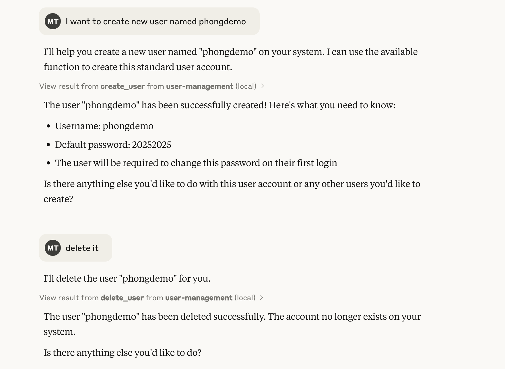

# MCP Create User

A tool for user creation/deletion with Claude Desktop.

## Prerequisites

- macOS/ubuntu
- UV Package Manager
- Claude Desktop

## Installation

### 1. Clone the Repository

Clone this repository to your local machine:
```bash
git clone https://github.com/maiphong0411/user-management-via-chat.git
cd user-management-via-chat
```
### 2. Copy env file
Copy the .env.example file to a new file named .env:
```bash
cp .env.example .env
```
Enter your admin password in .env.

### 3. Install UV Package Manager

Install UV using Homebrew and dependencies:

```bash
brew install uv
```

Install dependencies:
```bash
uv sync
```

### 4. Install and Add config to Claude Desktop
Make sure that you have installed Claude Desktop.
Link for download: https://claude.ai/download

Open config file:

``` bash
code ~/Library/Application\ Support/Claude/claude_desktop_config.json
```

This is the template:
```json
{
    "mcpServers": {
        "user-manager": {
            "command": "uv",
            "args": [
                "--directory",
                "/ABSOLUTE/PATH/TO/PARENT/FOLDER",
                "run",
                "mcp_server.py"
            ]
        }
    }
}
``` 

Please replace the path to the parent folder with the absolute path to the folder where you cloned this repository.

Finally, start Claude Desktop and chat with Claude.

Example: I want to create new user named phongdemo

When it is created successfully, it will return the default password and you must change the password at the first login.



Check user in local computer:
```bash
dscl . -list /Users | grep phongdemo
```

## Contact:
If you have any questions or need assistance, please contact me at:
- Email: phong.mt184172@gmail.com